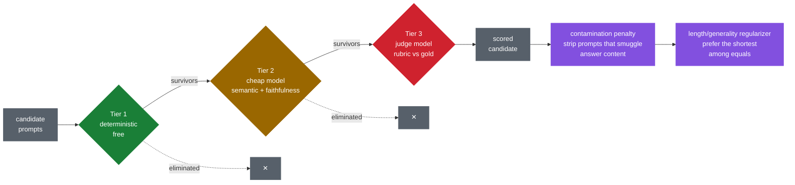

# ReversedPrompts

An agentic flow to guess prompts that generate an output from an input set.

Given pairs of `(input files, output artifacts)`, recover the prompt that maps inputs to
outputs — including the style, structure, and content-selection rules that a naive
instruction like *"summarize this document"* would miss — then execute that recovered
prompt against new inputs using agentic RAG.

📄 **[Design & implementation plan](docs/DESIGN.md)**

## Status

Design phase, plus the evaluation data the implementation will be built against. No
induction pipeline yet.

- `data/` — one document and 20 `(prompt, output)` pairs. See [data/README.md](data/README.md).
- `tools/` — the scripts that produced that data, both reproducible.
- `tests/` — integrity checks over the pair set.

## Architecture

Two loops. **Induction** runs offline and recovers a `PromptSpec` from evidence;
**execution** runs online and applies that spec to new inputs. What makes either agentic
is the cycle — neither is a pipeline that runs once and stops.


<sub>🟩 built · 🟨 partial · ⬜ designed, not built · 🟪 guardrail</sub>

The dotted branch off **Align** is the one that matters most — see below.

### What makes it agentic

**The loop is the point.** `D → E → C` cycles until the candidate converges or the budget
runs out. State persists across rounds — an OPRO-style trajectory of `(spec, score)` pairs
so the optimizer can see what it has already tried and what it cost. That shape, cyclic
and stateful and interruptible, is what argues for a graph orchestrator over a script.

**Self-critique drives the edits.** Refinement isn't resampling. For the worst dev
examples the system produces a *textual gradient* — a critique of why this candidate
missed gold — and edits the spec in the opposite semantic direction.

**Roles, not one model.** Four distinct jobs with different cost/quality profiles: a
frontier reasoner to hypothesize and refine, a mid-tier executor that runs every candidate
over every doc (the cost center), a cheap model for structural feature extraction, and a
judge. The judge must never be the model that proposed — otherwise the loop optimizes
toward the judge's quirks rather than toward quality.

**Spend is a first-class constraint.** The evaluation cascade exists so expensive judgment
is rationed to candidates that already survived free filtering:



<sub>🟩 free · 🟨 cheap · 🟥 expensive · 🟪 guardrail</sub>

### The two load-bearing pieces

**Align (B) is the central primitive.** Mapping output spans back to the input spans that
support them is what produces nearly all the evidence: what content survives into the
output and what is systematically dropped (the selection policy), the compression ratio
(length budget), whether the output follows the input's order or reorganizes it (a tell
for map-reduce vs. plan-first generation), and how verbatim the overlap is (extractive vs.
abstractive). It also generalizes past documents — doc→summary, spec→code,
contract→extracted JSON and transcript→minutes are all the same question.

**Unattributable spans are the highest-value guardrail.** Output content with no support
anywhere in the input gets surfaced to a human as *"this can't have come from the input"* —
never passed to the hypothesizer. Without that gate, the hypothesizer's rational move is to
invent an instruction that fabricates the content, and the system compiles hallucination
directly into the prompt it hands you.

Full detail in [docs/DESIGN.md](docs/DESIGN.md).

## Running the checks

```bash
pip install -e '.[dev]'
pytest
```

That needs no API key and costs nothing. It verifies the pairs are well-formed, that every
stored output was generated against the corpus currently in the tree, and that the prompts
carrying explicit constraints have outputs that satisfy them.

In CI, the same checks run from the **checks** workflow — Actions tab → *checks* → *Run
workflow*. It is manual-only; nothing runs on push.

## Talking to the API

Model access is the **OpenAI API** with a single `OPENAI_API_KEY` (§7 of the design doc).

```bash
export OPENAI_API_KEY=sk-...
python tools/smoke_openai.py                    # cheapest pair
python tools/smoke_openai.py --pair reason-02   # a hard one
python tools/smoke_openai.py --list-models
```

This runs one pair's gold prompt against the corpus and prints the model's answer beside
the stored one — the Phase 0 executor step in miniature. It sends the whole ~20k-word
document, so each run costs real money.

The same script runs in CI as the **api-smoke** job, which is off unless you tick
`run_api_smoke` when starting the workflow.

### Configuring the key in GitHub

The smoke job reads `OPENAI_API_KEY` from an environment named `openai`:

1. **Settings → Environments → New environment**, name it `openai`.
2. **Add secret** → name `OPENAI_API_KEY`, paste the key.
3. Optionally add yourself under **Required reviewers** so the job pauses for approval
   before it can spend anything.

An environment is used rather than a plain repository secret so the spend can be gated. Set
a usage limit on the key itself in the OpenAI dashboard too — repository permissions are
the lock, but the cap is what bounds the damage if a key ever leaks.

Fork PRs do not receive secrets, so the smoke job cannot run from an external
contribution. That is intended.

## Regenerating the data

```bash
pip install -e '.[ingest]'
python tools/pdf_to_markdown.py 2504.18875v1.pdf data/corpus/agentic-ai-survey.md
python tools/build_pairs.py
```

Both are deterministic. `tools/build_pairs.py --check` fails if the committed JSONL has
drifted from its source, and `pytest` runs that check for you.
