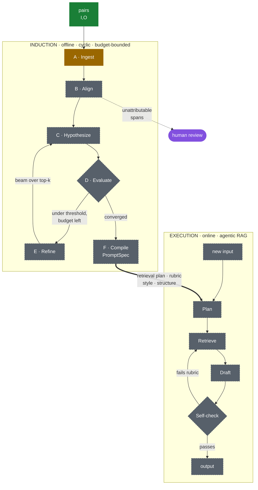
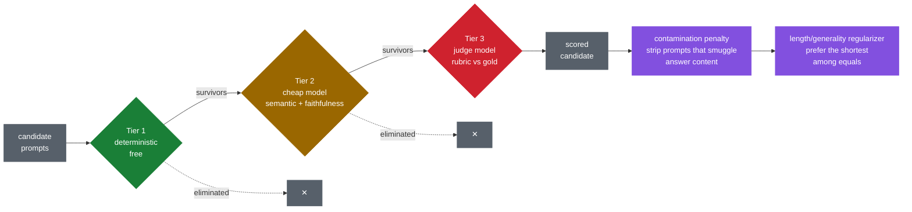

# ReversedPrompts

An agentic flow to guess prompts that generate an output from an input set.

Given pairs of `(input files, output artifacts)`, recover the prompt that maps inputs to
outputs — including the style, structure, and content-selection rules that a naive
instruction like *"summarize this document"* would miss — then execute that recovered
prompt against new inputs using agentic RAG.

📄 **[Design & implementation plan](docs/DESIGN.md)**

## Two kinds of prompt

The word "prompt" means two different things here, and keeping them apart is the whole
point of the design:

- **The system's own instructions** — the producer, critic, reviser and similarity judge.
  We author these. They live in `src/reversed_prompts/prompts.py`, versioned, and the
  version is stamped on every result. `revprompt show-prompts` prints them.
- **The recovered prompt** — what the system outputs, one per prompt group. *This is the
  product.*

## Status

**Recovery loop built.** Given an input and the output someone produced from it, the
system proposes an instruction, runs it, critiques the result, and revises. Align (`[B]`)
and RAG remain Phase 2.

- `src/reversed_prompts/` — the slice: prompts, features, metrics, similarity, client, loop, CLI.
- `data/` — 20 altered passages from the Odyssey, 38 pairs in 13 groups. See [data/README.md](data/README.md).
- `tools/` — the scripts that produced that data, both reproducible.
- `tests/` — 69 checks, none of which need a key.

### Prompt groups

A **prompt group** is the unit of recovery: the pairs produced by one instruction. Every
group in the current set applies its instruction across several inputs **whose answers
differ**, which is what stops a recovered prompt from passing by describing the one answer
it happened to see.

One group carries **negatives** — inputs where the right answer is "not here." That case
is the difference between recovering a rule and recovering an answer. Shown a text with
author names and an output listing them, both of these look correct:

```
list the author names
extract the author names, return NA if none
```

Only the second survives an input with no authors in it.

A group's score is its **weakest** member, not its average — an instruction that works on
two inputs out of three has not been recovered.

### The test set is also a groundedness probe

The passages are Homer's Odyssey **with facts deliberately changed**. The stake is cedar,
not olive. Telemachus strings the bow, or it snaps and nobody does. The men escape in whey
jars rather than under the sheep.

Every model has read the Odyssey, so a wrong answer here is diagnostic: it means the model
answered from memory rather than from the text in front of it. That matters for this
project specifically, because **a recovered prompt that scores well only because the model
already knew the answer has not been validated at all.**

Tests enforce that the alterations actually defeat memory — no gold answer may match what
Homer says, and the variants within a group may not all answer alike. See
[data/README.md](data/README.md).

### Two scores, because neither is sufficient alone

| Score | Question | Needs the gold prompt? |
|---|---|---|
| **Output fidelity** | Does running this instruction reproduce the wanted output? | No |
| **Prompt match** | Would someone following this behave like someone following the gold? | Yes |
| **Contamination** | Did it smuggle the answer into the instruction? | No |

The loop optimises output fidelity, because that is the only signal available without
peeking at the answer. Prompt match is computed afterwards, never inside the loop — the
gold prompt must not reach the producer or the critic, and a test asserts it does not.

Contamination is reported separately and never averaged in. A prompt containing the answer
scores beautifully on the other two and is worthless.

## Architecture

Two loops. **Induction** runs offline and recovers a `PromptSpec` from evidence;
**execution** runs online and applies that spec to new inputs. What makes either agentic
is the cycle — neither is a pipeline that runs once and stops.



<sub>🟩 built · 🟨 partial · ⬜ designed, not built · 🟪 guardrail</sub>

The dotted branch off **Align** is the one that matters most — see below.

### What makes it agentic

**The loop is the point.** `D → E → C` cycles until the candidate converges or the budget
runs out. State persists across rounds — an OPRO-style trajectory of `(spec, score)` pairs
so the optimizer can see what it has already tried and what it cost. That shape, cyclic
and stateful and interruptible, is what argues for a graph orchestrator over a script.

**Self-critique drives the edits.** Refinement isn't resampling. For the worst dev
examples the system produces a *textual gradient* — a critique of why this candidate
missed gold — and edits the spec in the opposite semantic direction.

**Roles, not one model.** Four distinct jobs with different cost/quality profiles: a
frontier reasoner to hypothesize and refine, a mid-tier executor that runs every candidate
over every doc (the cost center), a cheap model for structural feature extraction, and a
judge. The judge must never be the model that proposed — otherwise the loop optimizes
toward the judge's quirks rather than toward quality.

**Spend is a first-class constraint.** The evaluation cascade exists so expensive judgment
is rationed to candidates that already survived free filtering:



<sub>🟩 free · 🟨 cheap · 🟥 expensive · 🟪 guardrail</sub>

### The two load-bearing pieces

**Align (B) is the central primitive.** Mapping output spans back to the input spans that
support them is what produces nearly all the evidence: what content survives into the
output and what is systematically dropped (the selection policy), the compression ratio
(length budget), whether the output follows the input's order or reorganizes it (a tell
for map-reduce vs. plan-first generation), and how verbatim the overlap is (extractive vs.
abstractive). It also generalizes past documents — doc→summary, spec→code,
contract→extracted JSON and transcript→minutes are all the same question.

**Unattributable spans are the highest-value guardrail.** Output content with no support
anywhere in the input gets surfaced to a human as *"this can't have come from the input"* —
never passed to the hypothesizer. Without that gate, the hypothesizer's rational move is to
invent an instruction that fabricates the content, and the system compiles hallucination
directly into the prompt it hands you.

Full detail in [docs/DESIGN.md](docs/DESIGN.md).

## Running the checks

```bash
python3 -m venv .venv
source .venv/bin/activate      # Windows: .venv\Scripts\activate
pip install -e '.[dev]'
pytest
```

That needs no API key and costs nothing. It verifies the pairs are well-formed, that every
stored output was generated against the corpus currently in the tree, and that the prompts
carrying explicit constraints have outputs that satisfy them.

In CI, the same checks run from the **checks** workflow — Actions tab → *checks* → *Run
workflow*. It is manual-only; nothing runs on push. That free job also indexes the whole
698k-character book, searches it, and scores the result, so the retrieval path is
exercised end to end without a key.

Two jobs spend money and are off unless ticked: `run_api_smoke` recovers one group's
prompt against the live API, and `run_retrieval_eval` scores retrieval with real
embeddings.

## Talking to the API

Model access is the **OpenAI API** with a single `OPENAI_API_KEY` (§7 of the design doc).

### Choosing the model

Every role defaults to `gpt-5.6-terra`. Change it without editing code:

```bash
revprompt models                          # what each role will use
revprompt models --available              # what this key can actually use
export REVPROMPT_MODEL=some-other-model   # all four roles
export REVPROMPT_MODEL_JUDGE=...          # just the judge
revprompt run --model ... --group ...     # one run only, beats both env vars
```

Precedence is `--model` → `$REVPROMPT_MODEL_<ROLE>` → `$REVPROMPT_MODEL` → default.

### How much of the document the system sees

The executor always gets the whole input. The producer and critic get the first
`--excerpt-chars` of it, 8092 by default, because the producer sees *every* document in
a group at once and that prompt would otherwise grow without bound as control sets get
larger.

Nothing in the shipped set hits that cap, and a test asserts it. If a future input does,
`run` prints a warning naming each cut input before spending anything — a low score on a
truncated group may mean *"could not see the evidence"* rather than *"could not recover
the prompt"*, and those must not be confused. Raise it with `--excerpt-chars N`.

A cap is the wrong tool once inputs get genuinely long — the evidence for an output sits
wherever it happens to be, and a prefix keeps the first N characters regardless. That is
what retrieval is for.

### Retrieval

Built, inspectable, and **not yet wired into the recovery loop**. Nothing about how
prompts are recovered has changed.

```bash
pip install -e '.[rag]'                       # adds lancedb
revprompt index odyssey data/source/odyssey-pg1727.txt
revprompt retrieve odyssey "Antinous the ringleader of the suitors" --expand 1
```

Hybrid: BM25 full-text and vector search, fused by reciprocal rank. Both are needed
because the tasks span both ends — *"name the main antagonist"* turns on a rare token that
keyword search nails and embeddings blur, while *"summarise this in three sentences"* has
no rare token at all. LanceDB is embedded and file-based; no server, no cloud service.

Embeddings use their own `$REVPROMPT_EMBEDDING_MODEL`, deliberately not the shared
`$REVPROMPT_MODEL` — a blanket chat-model setting must not silently become the embedding
model. Vectors are cached on disk by `(model, text)`, so re-indexing an unchanged document
is free and changing the model can never mix two models' vectors in one index.

The index lives in `data/index/` and is gitignored. Rebuild it with `revprompt index`.

#### Scoring retrieval

`revprompt eval-retrieval` scores each arm separately against known-relevant chunks, so
*"hybrid search works"* becomes a number rather than a hope. Four probes: two turning on a
rare proper noun, two phrased as descriptions with the name withheld.

```bash
revprompt eval-retrieval                      # free, offline double
revprompt eval-retrieval --real-embeddings    # ~$0.01, the one that decides anything
```

**Retrieval quality is not yet established.** With the *offline* hashing embedder:

```
probe       relevant    keyword     vector      fused
antagonist        44     5/5        0/5        3/5
cyclops            6     2/5        0/5        2/5
shroud             7     0/5        0/5        0/5
sirens             9     1/5        0/5        1/5
mean p@5                  0.400      0.000      0.300
```

Fusion scores *below* keyword alone — averaging in a bad ranking makes a good one worse —
and the two description-shaped probes are the ones keyword search cannot do. Both are
expected: the offline embedder has lexical similarity and no semantics. Neither is a
verdict on retrieval, which is why the command reports the arms separately and prints a
warning when the fused number is the worst of the three.

The same measurement against real embeddings is what decides whether the vector arm earns
its place. Run it from the Actions tab by ticking `run_retrieval_eval`; the report is kept
as an artifact so two runs can be compared rather than remembered.

The models are checked against the API before any call is made, so a wrong id fails
immediately with a list of close matches rather than dying part-way through a run.
**A model change re-baselines every score** — results from different models are not
comparable, which is why the model is recorded on every result.

```bash
export OPENAI_API_KEY=sk-...
revprompt run --group ody-speaker-name --show-outputs   # the cheapest group
revprompt run --group ody-bow-outcome --show-outputs    # a major alteration
revprompt run                                           # every group
```

Each group's passages are short, so a single group costs very little. `--show-outputs`
prints what the recovered instruction produced beside what was wanted.

The same script runs in CI as the **api-smoke** job, which is off unless you tick
`run_api_smoke` when starting the workflow.

### Configuring the key in GitHub

The smoke job reads `OPENAI_API_KEY` from an environment named `openai`:

1. **Settings → Environments → New environment**, name it `openai`.
2. **Add secret** → name `OPENAI_API_KEY`, paste the key.
3. Optionally add yourself under **Required reviewers** so the job pauses for approval
   before it can spend anything.

An environment is used rather than a plain repository secret so the spend can be gated. Set
a usage limit on the key itself in the OpenAI dashboard too — repository permissions are
the lock, but the cap is what bounds the damage if a key ever leaks.

Fork PRs do not receive secrets, so the smoke job cannot run from an external
contribution. That is intended.

## Regenerating the data

```bash
python tools/build_odyssey.py
```

Deterministic. `--check` fails if the committed passages or pairs have drifted from the
builder, and `pytest` runs that check for you.
